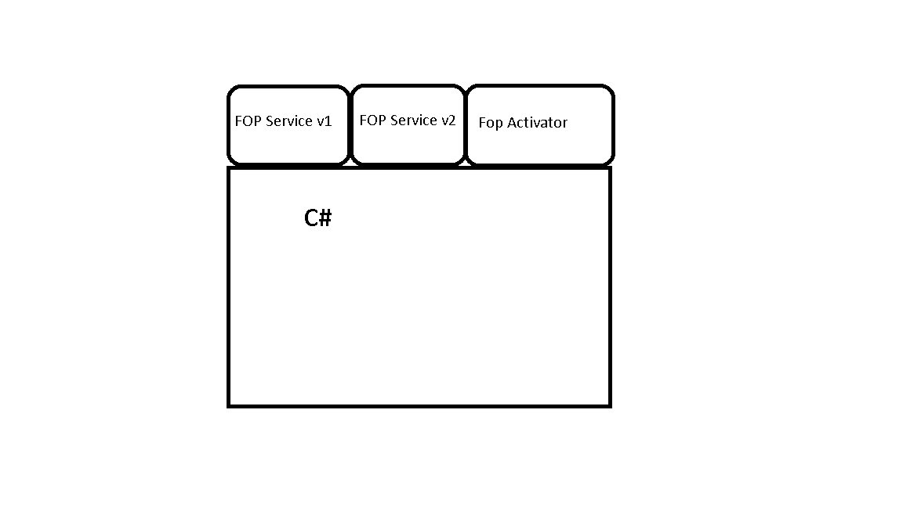

# Мост между C# и Java

Приложение, которое запускает JVM внутри C# процесса и помогает им общаться между собой по tcp/ip при помощи protobuf

### Version
1.0

### Архитектура

- Внутри C# процесса запускается JVM
- Идет загрузка java класса, который отвечает за запуск fop сервисов (FopActivator)
- FopActivator c с помощью своего class loader запускает различные версии или различные экземпляры fop сервиса
- C# процесс общается в JVM по tcp при помощи protobuf
- Вместе с завершением C# процесса JVM уничтожается

### Структура проекта

Dillinger uses a number of open source projects to work properly:

* [JvmClient](JvmClient.md) 
* [JvmManager](JvmManager.md)
* [protos](protos.md)
* [FopService](FopService.md)
* [FopActivator](FopActivator.md) 

### Настройка машины

* Установить java необходимой версии ([скачать](http://www.oracle.com/technetwork/java/javase/downloads/index.html))
* Установить maven ([скачать](https://maven.apache.org/download.cgi))
* Установить системную переменную JAVA_HOME (путь, по которому установлена java)
* Установить системную переменную M2_HOME (путь, по которому установлен maven)
* Установить системную переменную M2 (M2_HOME\bin)
* Добавить в Path JAVA_HOME\bin
* Добавить в Path JAVA_HOME\jre\bin
* Добавить в Path JAVA_HOME\jre\bin\server
